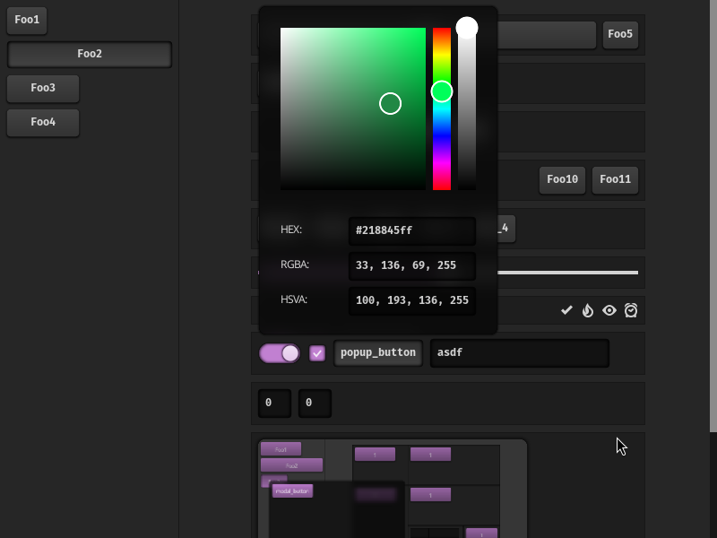

A toy gui application done for the purpose of studying immediate mode graphics UI's.

It's implemented on top of openGl and sdl3.

There is support for:

 - A simple layout system.
 - A css-like styling mechanism.
 - Simple animation.
 - Basic widgets: buttons, scrollview, scrollbars, dialogs, grids/tables, ...
 - Keyboard focus navigation.
 - Blur effect.
 - A simple text editor.
 - Support for tiles/tabs.

Big thanks to the raddbg and orca projects for many of the ideas.

The project is written in C2y, so you need newer versions of gcc/clang.
You also need sdl3, freetype, and harfbuzz devel packages.
